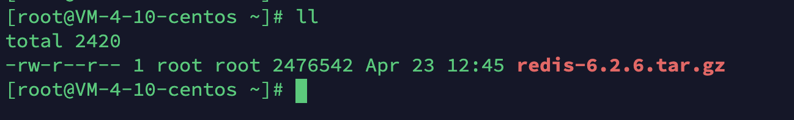
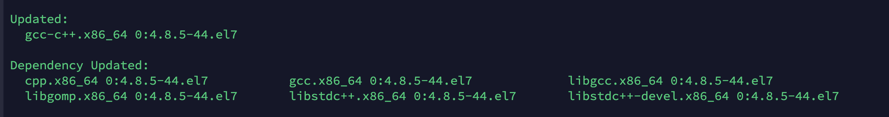
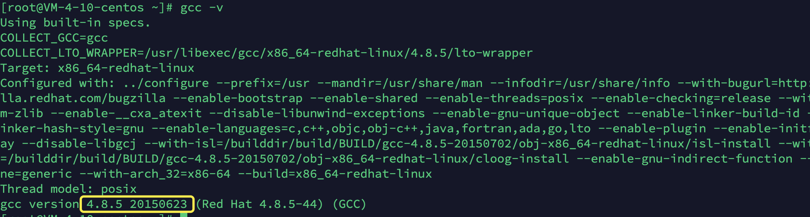
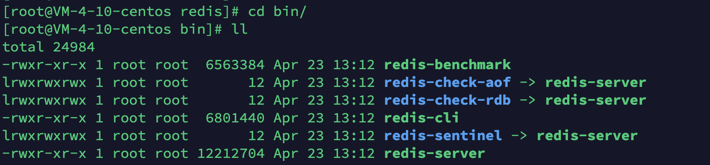

# Redis详细安装步骤
## Redis软件安装
### 第一步：下载安装包
下载地址：https://redis.io/download，一般下载稳定版（Stable），截止目前为止最新版是6.2.6
### 第二步：上传至服务器

或者 wget 远程下载。
```shell
wget -P /usr/local/src/ https://download.redis.io/releases/redis-6.0.9.tar.gz
```
### 第三步：解压
```shell
tar zxvf redis-6.0.9.tar.gz
```
### 第四步：安装依赖
```shell
yum -y install gcc-c++ autoconf automake
```

> [!tip]
> 升级GCC:
> - 这里需要说明一下：在编译 Redis 6 之前需要升级 gcc 的版本，默认情况 yum 安装的 gcc 版本是 4.8.5，如下图：

> - 由于版本过低，在编译时会报如下错误
> - 所以我们需要执行以下操作升级 GCC
> ```shell
yum install -y centos-release-scl scl-utils-build
yum install -y devtoolset-9-toolchain
scl enable devtoolset-9 bash
gcc -v

### 第五步：预编译
- 切换到解压目录
```shell
cd redis-5.0.3/
make
```


### 第六步：安装
- 创建安装目录
```shell
mkdir -p /usr/local/redis
```
> [!tip]
> 注意:
> - 不使用：make install（make install默认安装到/usr/local/bin目录下） 
> - 使用：如果需要指定安装路径，需要添加PREFIX参数
- install
```shell
make PREFIX=/usr/local/redis/ install 
```
- 安装成功如图所示：


- 安装成功后的几个文件解释
  - redis-benchmark 性能测试工具
  - redis-check-aof AOF文件修复工具
  - redis-check-rdb RDB文件修复工具
  - redis-cli 客户端命令行
  - redis-sentinal 集群管理工具
  - redis-server 服务进程指令

### 第七步：启动
- 安装的默认目标路径：/usr/local/redis/bin
```shell
cd /usr/local/redis/bin/
```
- 启动
```shell
./redis-server
```
- 启动方式
  - 第一种：执行 ./redis-server命令，执行Ctrl + C就会停止服务
  - 第二种：守护进程启动：
    - redis.conf是Redis的配置文件，安装完后，可以复制redis.conf文件到安装路径下
    - ```shell
cp redis.conf /usr/local/redis/bin/
```
    - 修改安装路径下的redis.conf，将daemonize修改为yes
  - 第三种：配置开机启动（centos7以上）
    - 在系统服务目录里创建redis.service文件 ``vim /etc/systemd/system/redis.service``
    - 写入以下内容:
    ```shell
    [Unit]
        Description=redis-server
        After=network.target
        
        [Service]
        Type=forking
        ExecStart=/usr/local/redis/bin/redis-server /usr/local/redis/bin/redis.conf
        PrivateTmp=true
        
        [Install]
        WantedBy=multi-user.target 
    ```
    - 配置描述：
      - Description:描述服务
      - After:描述服务类别
      - [Service]服务运行参数的设置
      - Type=forking是后台运行的形式
      - ExecStart为服务的具体运行命令
      - ExecReload为重启命令
      - ExecStop为停止命令
      - PrivateTmp=True表示给服务分配独立的临时空间
      > [!tip]
      > 注意：[Service]的启动、重启、停止命令全部要求使用绝对路径
    - 重载系统服务：systemctl daemon-reload
    - 测试并加入开机自启
      - 关闭redis-server：systemctl stop redis.service
      - 开启redis-server：systemctl start redis.service
      - 查看redis-server状态：systemctl status redis.service
    - 开启成功，将服务加入开机自启
    ```shell
    systemctl enable redis.service
    ```
    


