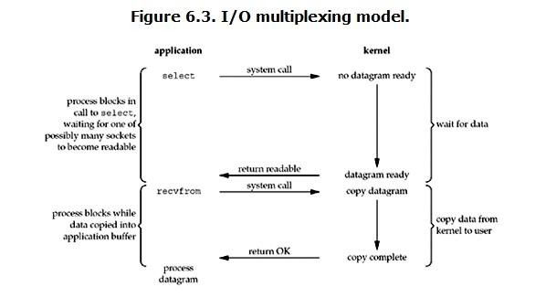

# Redis的高并发
> 官方的bench-mark数据：测试完成了50个并发执行100000个请求。设置和获取的值是一个256字节字符串。结果：读的速度是110000次/s,写的速度是81000次/s。redis尽量少写多读，符合缓存的适用要求。单机redis支撑万级，如果10万+可以采用主从复制的模式。

## 原理
- Redis是纯内存数据库，一般都是简单的存取操作，线程占用的时间很多，时间的花费主要集中在IO上，所以读取速度快。
- Redis使用的是非阻塞IO，IO多路复用，使用了单线程来轮询描述符，将数据库的开、关、读、写都转换成了事件，减少了线程切换时上下文的切换和竞争。
- Redis采用了单线程的模型，保证了每个操作的原子性，也减少了线程的上下文切换和竞争。
- Redis存储结构多样化，不同的数据结构对数据存储进行了优化，如压缩表，对短数据进行压缩存储，再如，跳表，使用有序的数据结构加快读取的速度。
- Redis采用自己实现的事件分离器，效率比较高，内部采用非阻塞的执行方式，吞吐能力比较大。

----
## Redis的单线程
### 原因
- 1）不需要各种锁的性能消耗
  > Redis的数据结构并不全是简单的Key-Value，还有list，hash等复杂的结构，这些结构有可能会进行很细粒度的操作，比如在很长的列表后面添加一个元素，在hash当中添加或者删除一个对象。这些操作可能就需要加非常多的锁，导致的结果是同步开销大大增加。总之，在单线程的情况下，就不用去考虑各种锁的问题，不存在加锁释放锁操作，没有因为可能出现死锁而导致的性能消耗。
- 2）单线程多进程集群方案
  > 单线程的威力实际上非常强大，每核心效率也非常高，多线程自然是可以比单线程有更高的性能上限，但是在今天的计算环境中，即使是单机多线程的上限也往往不能满足需要了，需要进一步摸索的是多服务器集群化的方案，这些方案中多线程的技术照样是用不上的。
- 3）CPU消耗
  > 采用单线程，避免了不必要的上下文切换和竞争条件，也不存在多进程或者多线程导致的切换而消耗 CPU。但是如果CPU成为Redis瓶颈，或者不想让服务器其他CPU核闲置，那怎么办？可以考虑多起几个Redis进程，Redis是key-value数据库，不是关系数据库，数据之间没有约束。只要客户端分清哪些key放在哪个Redis进程上就可以了。

### 优劣
#### 单进程单线程优势
- 代码更清晰，处理逻辑更简单 
- 不用去考虑各种锁的问题，不存在加锁释放锁操作，没有因为可能出现死锁而导致的性能消耗 
- 不存在多进程或者多线程导致的切换而消耗CPU

#### 单进程单线程弊端
- 无法发挥多核CPU性能，不过可以通过在单机开多个Redis实例来完善

----
### IO多路复用技术
redis 采用网络IO多路复用技术来保证在多连接的时候， 系统的高吞吐量。
> 多路-指的是多个socket连接，复用-指的是复用一个线程。多路复用主要有三种技术：select，poll，epoll。epoll是最新的也是目前最好的多路复用技术。

> 这里“多路”指的是多个网络连接，“复用”指的是复用同一个线程。采用多路 I/O 复用技术可以让单个线程高效的处理多个连接请求（尽量减少网络IO的时间消耗），且Redis在内存中操作数据的速度非常快（内存内的操作不会成为这里的性能瓶颈），主要以上两点造就了Redis具有很高的吞吐量

